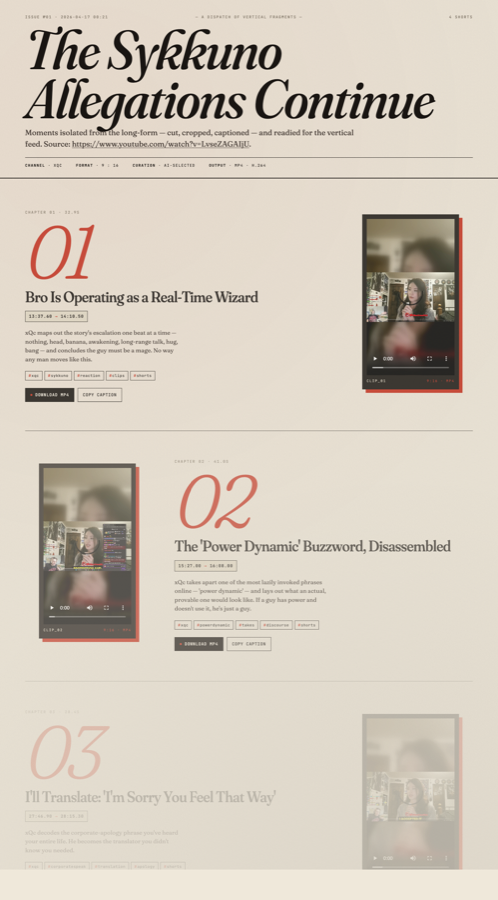
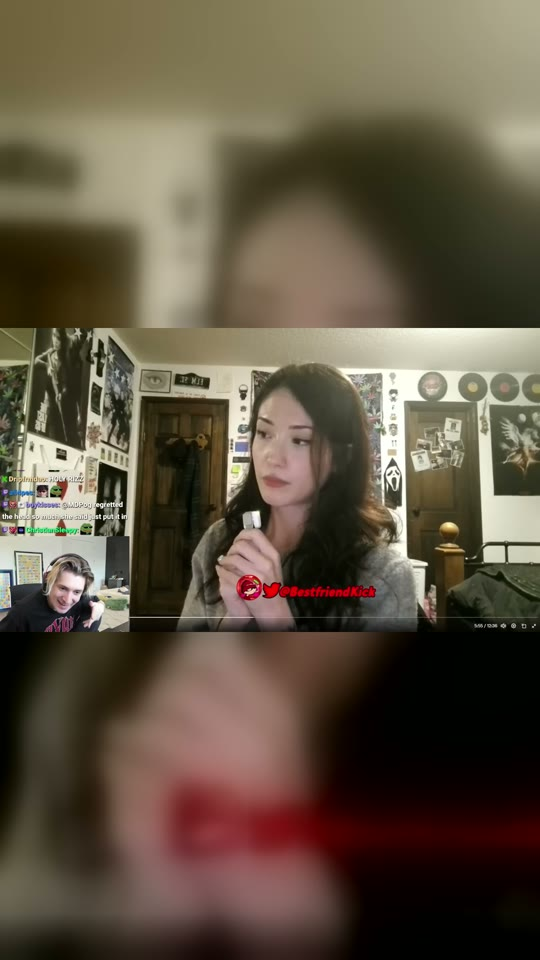
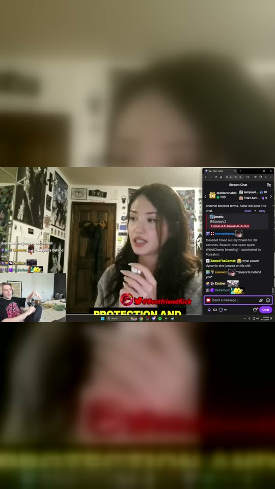
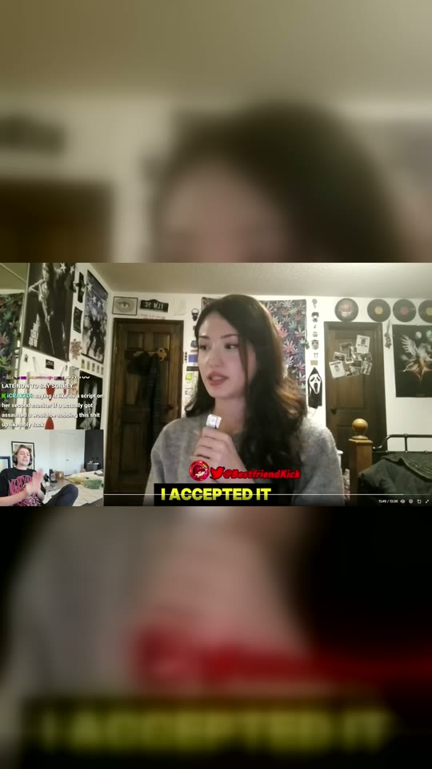
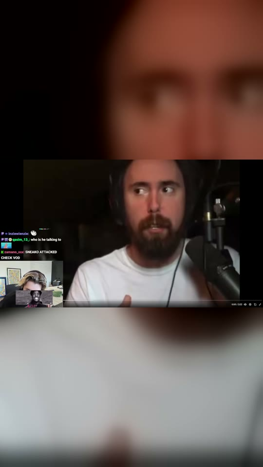

# yt-vid-to-shorts

A Claude Code skill that turns any YouTube video into a gallery of AI-picked vertical short-form clips — each with a generated title, caption, hashtags, and its own download button — rendered as a styled HTML page.



## Demo

Ran against [`xQc — The Sykkuno Allegations Continue`](https://www.youtube.com/watch?v=LvseZAGAIjU). Click a thumbnail to play the clip (downloads from GitHub's CDN):

### 01 · Bro Is Operating as a Real-Time Wizard
xQc maps out the story's escalation one beat at a time — nothing, head, banana, awakening, long-range talk, hug, bang — and concludes the guy must be a mage. No way any man moves like this.

`#xqc` `#sykkuno` `#reaction` `#clips` `#shorts`

[](https://github.com/jabreeflor/yt-vid-to-shorts/raw/main/docs/demo/clip_01.mp4)

https://github.com/jabreeflor/yt-vid-to-shorts/raw/main/docs/demo/clip_01.mp4

### 02 · The 'Power Dynamic' Buzzword, Disassembled
xQc takes apart one of the most lazily invoked phrases online — 'power dynamic' — and lays out what an actual, provable one would look like. If a guy has power and doesn't use it, he's just a guy.

`#xqc` `#powerdynamic` `#takes` `#discourse` `#shorts`

[](https://github.com/jabreeflor/yt-vid-to-shorts/raw/main/docs/demo/clip_02.mp4)

https://github.com/jabreeflor/yt-vid-to-shorts/raw/main/docs/demo/clip_02.mp4

### 03 · I'll Translate: 'I'm Sorry You Feel That Way'
xQc decodes the corporate-apology phrase you've heard your entire life. He becomes the translator you didn't know you needed.

`#xqc` `#corporatespeak` `#translation` `#apology` `#shorts`

[](https://github.com/jabreeflor/yt-vid-to-shorts/raw/main/docs/demo/clip_03.mp4)

https://github.com/jabreeflor/yt-vid-to-shorts/raw/main/docs/demo/clip_03.mp4

### 04 · Hate Streaming? Go Flip a Burger.
xQc erupts on streamers who complain about the thing they chose to do. If you don't like it, don't do it — go to Burger King. Little bit of an ego. Okay.

`#xqc` `#streamerdrama` `#motivation` `#rant` `#shorts`

[](https://github.com/jabreeflor/yt-vid-to-shorts/raw/main/docs/demo/clip_04.mp4)

https://github.com/jabreeflor/yt-vid-to-shorts/raw/main/docs/demo/clip_04.mp4

## Install

Drop this directory into your Claude skills path:

```bash
git clone https://github.com/jabreeflor/yt-vid-to-shorts.git ~/.claude/skills/yt-vid-to-shorts
```

## Requirements

- `yt-dlp`
- `ffmpeg` (with `ffprobe`)
- `python3`

On macOS: `brew install yt-dlp ffmpeg`.

## How it works

1. `scripts/fetch.py` — downloads the video (≤1080p mp4) and YouTube's auto-caption VTT.
2. `scripts/parse_vtt.py` — turns the VTT into a word-level-timestamped `transcript.json`.
3. **Claude reads the transcript and picks clips**, writing `proposals.json`.
4. `scripts/cut_clips.py` — ffmpeg re-encode with `blur-pad` (default) / `crop` / `letterbox` / `source` fit modes, audio loudness normalized to -16 LUFS.
5. `scripts/render_gallery.py` — injects the clips into an editorial-style HTML template.
6. `scripts/serve.py` — serves the gallery on `http://127.0.0.1:8723/gallery.html` so `<video>` playback works (Chrome blocks it over `file://`).

## Use it

Paste a YouTube URL to Claude along with any of: "make shorts", "clip this", "pull the highlights", "break this up". The skill handles the rest.

## Manual run

```bash
WORK=./work && mkdir -p "$WORK/clips"
python3 scripts/fetch.py 'https://www.youtube.com/watch?v=LvseZAGAIjU' "$WORK"
python3 scripts/parse_vtt.py "$WORK/captions.vtt" "$WORK/transcript.json"
# ... write $WORK/proposals.json (see SKILL.md schema) ...
python3 scripts/cut_clips.py "$WORK/proposals.json" "$WORK/video.mp4" "$WORK/clips"
python3 scripts/render_gallery.py "$WORK/proposals.json" "$WORK/clips" "$WORK/meta.json" assets/gallery.html.template "$WORK/gallery.html"
python3 scripts/serve.py "$WORK"  # opens http://127.0.0.1:8723/gallery.html
```

## Fit modes

| Mode | When to use |
| --- | --- |
| `blur-pad` (default) | Any source. Blurred, zoomed-to-fill backdrop with the unmodified frame centered on top. The Reels/TikTok look. |
| `crop` | Talking-head videos where the subject is centered. Center-crops 16:9 → 9:16. |
| `letterbox` | Preserve everything with solid black bars top and bottom. |
| `source` | Keep original aspect ratio (no 9:16 conversion). |

## Layout

```
yt-vid-to-shorts/
├── SKILL.md                     # orchestrator Claude reads
├── scripts/
│   ├── fetch.py
│   ├── parse_vtt.py
│   ├── cut_clips.py
│   ├── render_gallery.py
│   └── serve.py
├── assets/
│   └── gallery.html.template    # editorial / newsprint aesthetic
└── docs/demo/                   # sample run against the LvseZAGAIjU video
```

## License

MIT
